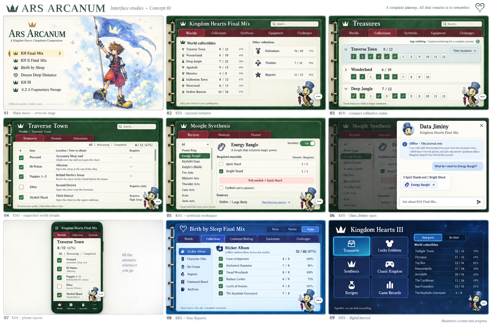

# Contact sheet 1

Generated visual concept based on the planning specifications. User review: positive initial gut check; no immediate correction requests. Image-generation drift is expected. The written requirements remain authoritative: illustrative labels, quantities, layouts and artwork in this sheet are not verified game data or a pixel-perfect implementation contract.

Retained unchanged for design history. Nine views: main menu, KH1 journal contents, compact collections, world details, synthesis, Data Jiminy, phone layout, BBS Reports and KH3 digital journal.
