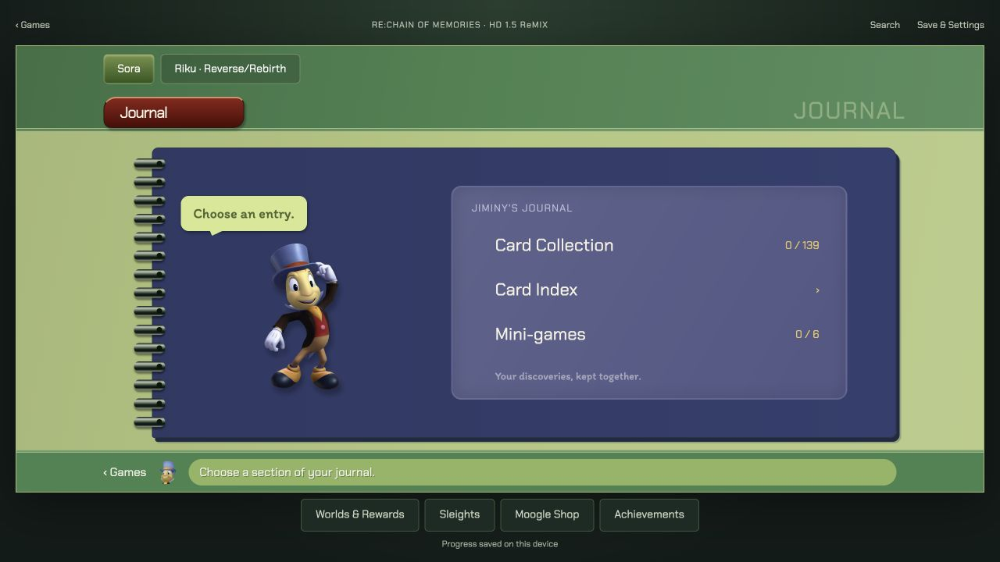
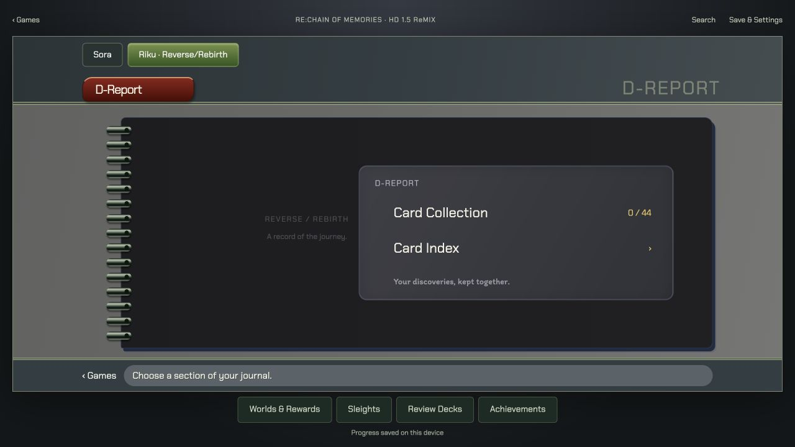

# Re:Chain of Memories HD journal implementation

2026-09-28. User authorized implementation following the [HD menu research](../ui/recom-menu-design-research.md), with the home entry between Kingdom Hearts Final Mix and Kingdom Hearts II Final Mix. Implemented locally; not deployed. This report describes the current working interface, not final artwork or complete native-game coverage.

## Working experience

- Home opens **Re:Chain of Memories · HD 1.5 ReMIX** in the requested position.
- Sora has the green Journal shell, purple ring-bound cover, red hierarchy tabs, cream interior and contextual footer. Riku has a charcoal D-Report with its own campaign navigation. Sleights, Moogle Shop and Review Decks use the blue system-menu treatment. These compositions follow the inspected HD references, not GBA or original PS2 imagery.
- Card Collection provides a paged card grid; Card Index provides family navigation. Records include acquisition notes, sources, uncertainty, linked rewards and independent discovery checks. Search, card-type and completion filters preserve the catalogue denominator and return context.
- Sora has mini-game records and separate world reward claims. Riku has twelve world deck references, including card values in source order. Sleights, Moogle pack prices and Steam goals are accessible from the companion navigation.
- Progress uses the existing per-game local database, backup/import and recovery infrastructure. Campaign-specific cards remain independent. Saving feedback reports successful database completion; mini-game scores do not automatically mark achievements.
- The journal, data and local assets are included in the existing offline build. Source links are external and require connectivity to visit; their accompanying notes remain local.

## Content delivered

`tools/content/build-recom.mjs` converts the research pack into the runtime catalogue during `content:build`. It retains source links and unresolved values rather than inventing missing facts.

| Runtime group | Entries |
|---|---:|
| Sora documented card identities | 139 |
| Riku documented card identities | 44 |
| Sleights across campaigns | 98 |
| Sora finite world reward claims | 41 |
| Riku world deck references | 12 |
| Moogle pack prices | 16 |
| Steam goals | 47 |
| Mini-game records | 6 |
| Total | 403 |

These are documented app entries, not native completion denominators. Cards and the reward claims that grant them have separate progress records. Card discovery is not a copy inventory. Reference decks do not consume stock or calculate CP.

## Visual review

Desktop at 1280 × 720 and phone at 390 × 844 were inspected in the in-app browser. The desktop cover, footer and utility links fit together; phone interiors use a scrollable single page with readable filters. Automated desktop and phone tests additionally check horizontal overflow, selection, filtering, campaign switching and record routes.

[Phone Card Collection capture](recom-screenshots/sora-collection-phone.png).

## Validation

- Production build passed, including the offline service worker. Existing large-bundle warnings remain.
- Full unit suite passed: 105 tests across 12 files, including six new Re:CoM tests for edition exclusions, campaign boundaries, source coverage, denominators, unknown CP, routes and database backup/recovery.
- Re:CoM browser suite passed: 10 tests across desktop and mobile Chromium. Covers home placement, Sora/Riku menus, card persistence after confirmed save and reload, filtered totals, campaign isolation, score persistence, reward links, Riku decks, invalid routes, empty results, backups, usable filters and offline reopening/campaign navigation.
- Service worker verification waits for installation and revisits the page before going offline, matching the existing prompt-based activation lifecycle.
- No native-game runtime or physical-device Safari acceptance is claimed.

## Remaining boundaries

- Card faces are original symbolic previews with initials; individual native card illustrations are not yet integrated. Jiminy imagery and substitute fonts reuse the existing local journal assets. Exact CoM fonts, cursor art and native illustrations remain artwork work.
- World/Gimmick cards and the complete Riku Battle Cards roster remain unreconciled. Partial coverage is labeled in the catalogue and settings; the app does not claim native 100% completion.
- Seven sourced enemy CP conflicts remain unresolved. The app exposes uncertainty and supplies no CP optimizer. Door-cost solving, copy/value/Premium inventory, exact bounty fallback rules and full retained boss-card/deck substitutions still require the documented evidence and implementation work.
- Story and Characters completion flags are outside the inherited collectible-compendium scope; they are not represented as implemented navigation.
- This pass does not implement a CoM-specific Data Jiminy assistant or assert final visual approval. The [readiness workbook](../readiness/kingdom-hearts-re-chain-of-memories.md) retains the remaining acceptance gates.

## Production release preparation

The user subsequently authorized production deployment together with the independently prepared home-menu restoration. The isolated CoM release excludes unrelated local BBS work. Its complete unit suite has 99 passing tests across 11 files; the earlier 105-test workspace run included six BBS tests. A production build using `/kh-tools/` passed. Publication is handled by the existing GitHub Pages workflow on `master`; the deployment run is the authoritative release result.
