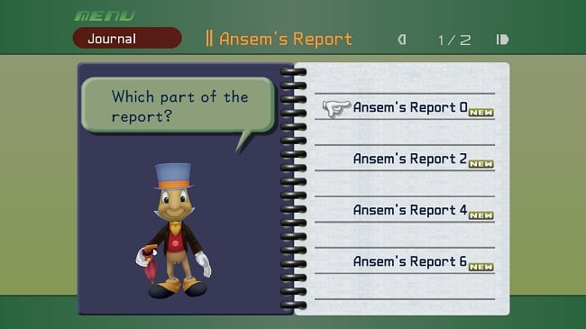
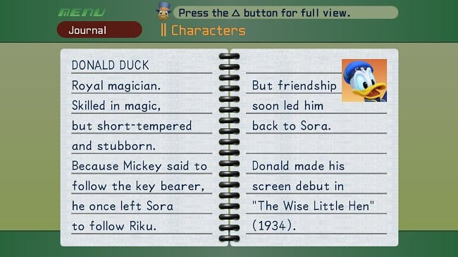

# KH1FM journal reference workbook

Inspected 2026-09-22. Supports [new UI plan](../../kh1fm-new-ui-plan.md). Images here are documentation/reference evidence only; they are not imported into the app bundle.

## Visually verified source images

### KH1-R01 — Report index

[Original image](https://images.khinsider.com/KINGDOM%20HEARTS%20HD%20ReMIX/Screenshots/Square%20Enix%20-%20September%2012%202013/KH%20journal%201.jpg) · [archive directory](https://images.khinsider.com/KINGDOM%20HEARTS%20HD%20ReMIX/Screenshots/Square%20Enix%20-%20September%2012%202013/)

650×365 JPEG. Hosted by KHInsider in an archive labeled “Square Enix - September 12 2013.” This is an HD promotional-era reference, not a verified current Steam capture. It shows an Ansem's Report index, **not the top-level journal contents**.

Observed: green header/footer; olive field; burgundy Journal label; gold section title; header arrows and page count; purple left leaf with Jiminy and a speech bubble; pale ruled right leaf; central black/metal binding; four visible report choices with a glove cursor and small NEW markers. The irregular visible report-number sequence must not be interpreted as the full roster or app ordering.

### KH1-R02 — Character reading spread

[Original image](https://images.khinsider.com/KINGDOM%20HEARTS%20HD%20ReMIX/Screenshots/Square%20Enix%20-%20September%2012%202013/KH%20journal%202.jpg) · same archive provenance as R01.

650×365 JPEG. Observed: two pale ruled pages, central binding, character name at the upper left, continuous prose across the spread, small upper-right portrait, and a Jiminy/help strip in the green header. A controller prompt advertises full view; the still does not demonstrate its behavior. Do not assume that prompt maps to an implemented browser feature.

## Other references and their limits

| ID | Source | Evidence / status |
|---|---|---|
| KH1-R03 | [User-supplied KH1 video](https://www.youtube.com/watch?v=O4YuKuGWZ-s) | Visually inspected in the preceding mockup pass: Sabor/Kala character pages and character model overlay. Limited coverage; exact seek positions were not preserved reliably, so no invented frame timestamps are cited |
| KH1-R04 | [KH Wiki — Jiminy's Journal, Kingdom Hearts section](https://www.khwiki.com/Jiminy%27s_Journal) | Secondary textual corroboration for Chronicles, Ansem's Report, Characters and its subgroups, 101 Dalmatians, Trinity Marks and Mini-Games. Use the page's Contents → Kingdom Hearts section if the generated anchor changes. Does not verify modern Final Mix layout or menu order |
| STUDY-01 | [Standalone mockup source](../../../../../ars-arcanum-journal-study/dist/index.html) and [notes](../../../../../ars-arcanum-journal-study/README.md) | User accepted the direction. Located in the sibling project; link requires that local checkout. Representative prose, fonts, page controls and canvas scaling are not canonical game behavior. Local preview was served at http://localhost:4178/ |
| KH2-R01 | [User-supplied KH2FM video](https://www.youtube.com/watch?v=rw8c9l0K1vU) | Future KH2 reference and overall clarity preference; do not borrow its world notebook as evidence of KH1 layout |
| BBS-R01 | [User-supplied BBS video](https://www.youtube.com/watch?v=lxqQ9umTmfs) | Future game reference. Mockup uses the observed amber Game Records screen; it does not settle every BBS character/report palette |

## Reference coverage and capture requests

| Screen/state | Coverage | What still needs observation |
|---|---|---|
| Section index | Verified still, R01 | Focus changes, entry open/return, page transitions |
| Character reading | Verified still + earlier video inspection | Modern platform prompts, long-entry page behavior |
| Journal contents | Textual category evidence only | Actual label/order, left/right composition, completion and NEW states |
| Dalmatians | Textual section evidence only | Puppy numbering, rescued indicators, world-count toggle, incomplete/complete states |
| Trinity Marks | Textual section evidence only | Color list, tally layout, selection and completion treatment |
| Mini-Games | Textual section evidence only | Activity index, record page, scrolling/pagination |
| Ansem report reading | Index verified, reading page not yet inspected | Report text pagination and acquisition-state presentation |
| Native section completion | Unverified visually in this pass | Exact emblem, placement, distinction from unread markers |
| App-only guide/tool pages | No native counterpart | Design proposals requiring review, not a source-search failure |

If further references are needed from the user: one English modern KH1FM recording that opens the journal contents, visits Dalmatians (including its alternate world view), Trinity Marks, Mini-Games, a report entry and then returns would address most gaps. Pause on each state long enough to inspect. A partially completed journal is useful for distinguishing status marks. No user recording is required before working on the verified shell/index/reading layouts.

## Asset handling

Keep these reference binaries outside `public/`. Production art/font selection gets a separate source and reuse record. The earlier prototype credits KH Wiki game renders, Televo's Re:Collection glove/crown/menu font and Google Fonts substitutes. Their use in a concept study does not establish exact font identity or make an image a native KH1 interface texture.
