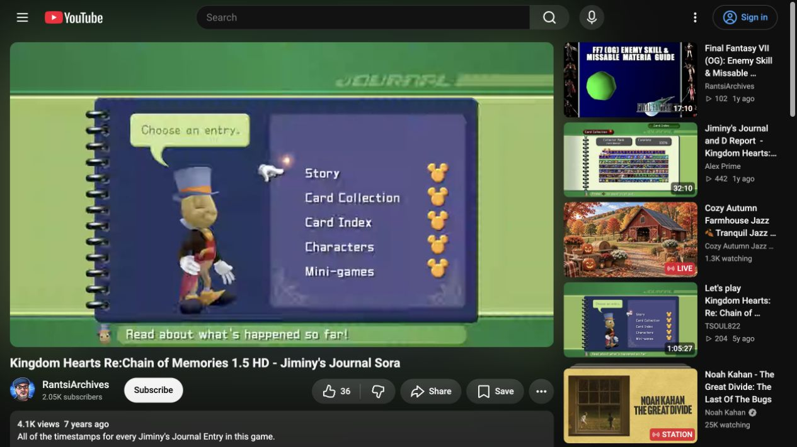
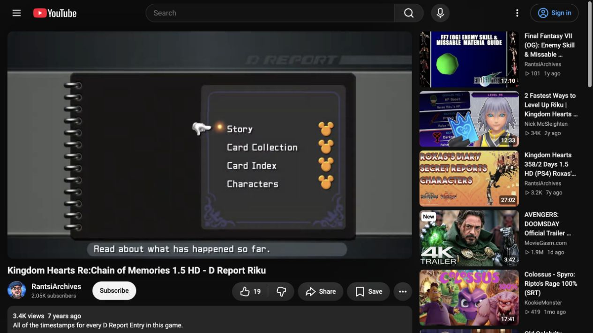
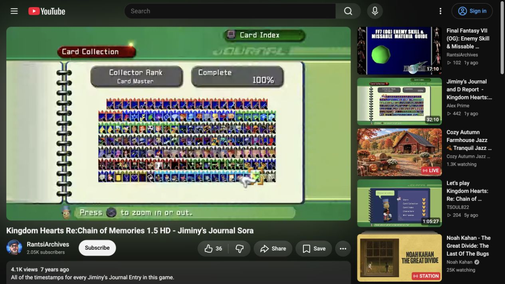
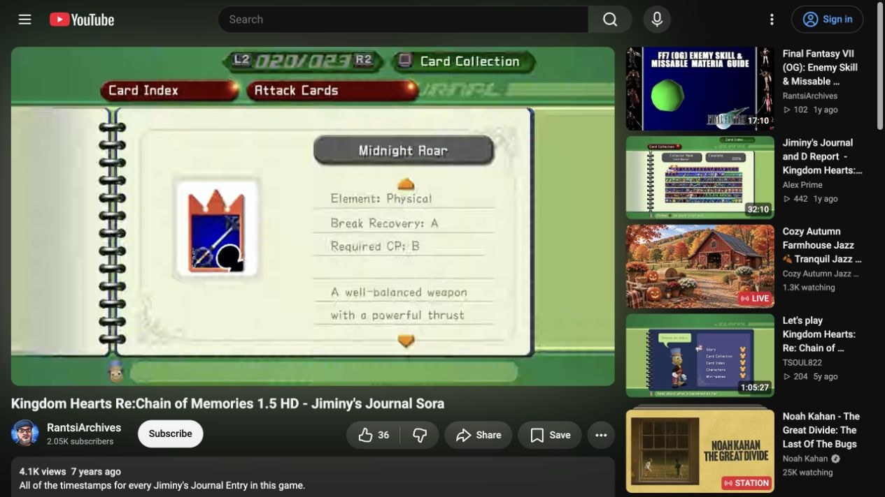
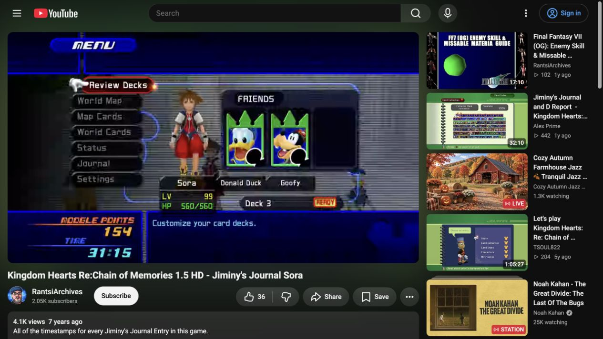
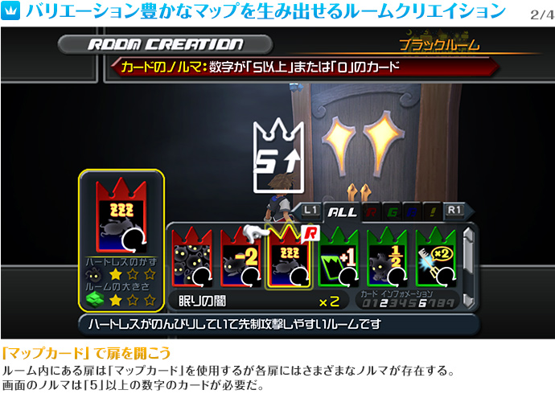

# Re:Chain of Memories HD menu reference workbook

Visually researched **2026-09-28**. **22 sampled video frames + 2 official HD promotional images**, saved here for documentation only. [Design brief](../../recom-menu-design-research.md) · [Frame manifest](source-manifest.json) · [Game specification](../../../games/kingdom-hearts-re-chain-of-memories.md).

The user requests the Re:Chain of Memories interface from **HD 1.5 ReMIX**, excluding the original PS2 and Game Boy Advance versions. This workbook supersedes the earlier text-only menu assumptions. These images are reference evidence outside `public/`; they are not production artwork or permission to redistribute game assets in the app.

## Sources and edition confidence

| ID | Source | Provenance and limits |
|---|---|---|
| COM-UI-S | [RantsiArchives — Kingdom Hearts Re:Chain of Memories 1.5 HD — Jiminy's Journal Sora](https://www.youtube.com/watch?v=hb2RFXT5tDI) | Published January 27, 2019; 46:55. Uploader explicitly identifies 1.5 HD; the page identifies the HD 1.5 + 2.5 collection. The inspected **Midnight Roar** entry independently corroborates HD content rather than the original PS2 roster. Exact recording hardware/build is not established. |
| COM-UI-R | [RantsiArchives — Kingdom Hearts Re:Chain of Memories 1.5 HD — D Report Riku](https://www.youtube.com/watch?v=dEv2eFLATZw) | Published January 27, 2019; approximately 9:15. Uploader identifies 1.5 HD. Companion recording with the matching HD presentation; exact hardware/build is not independently established. |
| COM-UI-O | [Square Enix — Re:Chain of Memories, HD 1.5 ReMIX official site](https://www.jp.square-enix.com/kingdom/khhd/khrecom.html) | First-party HD-release provenance. Japanese promotional panels include game screenshots and explanatory copy; the white/cyan outer captions belong to the website, not the game interface. Only HD system panels are retained; the site's SD comparison images are excluded. |

Videos were sampled at specific positions, not watched in full. Timestamps below are rounded navigation targets; the manifest preserves measured playback times. Screenshots were taken after seeking and visually checked. Saved video references are unmodified 1265×712 browser screenshots; the game occupies an approximately 873×491, 16:9 area. Browser navigation, recommendations and other page elements remain around it and are not game UI. These dimensions do not establish source-video resolution. Compression/antialiasing makes them unsuitable for exact font identification, pixel-perfect color sampling, or original-asset extraction. Any YouTube player controls are also outside the native interface.

## Representative screens

### Sora Journal root

[0:10 source](https://www.youtube.com/watch?v=hb2RFXT5tDI&t=10s). Green top/footer bands and an olive field surround a blue-purple ring-bound cover. Rings run down the **left outer edge**, not the middle of a KH1-style two-page spread. Jiminy and a pale green speech bubble occupy the left area; the menu sits on a lighter inset panel at right. White glove, small gold selection glow, white labels and a separate right-hand column of gold Mickey-head marks.

Native order: **Story → Card Collection → Card Index → Characters → Mini-games**. The marks are visible in this completed-save sample; their exact earning predicates and unread-state behavior are not established by the image alone.

### Riku D-Report root

[0:02 source](https://www.youtube.com/watch?v=dEv2eFLATZw&t=2s). Charcoal header/footer, gray field, black cover, subdued violet ornament around the right menu inset. The left cover area is empty in this sample; there is no Jiminy model or speech bubble. Native order: **Story → Card Collection → Card Index → Characters**. The book geometry, glove and gold marks are related to Sora's, but campaign identity changes more than a portrait.

### Card Collection

[5:20 source](https://www.youtube.com/watch?v=hb2RFXT5tDI&t=320s). One pale page with left binding. Two gray rounded plaques show collector rank and completion percentage above a tightly packed, card-shaped mosaic. Gold corner brackets and the glove identify the selected card. The footer advertises zoom; the upper-right prompt switches to Card Index. The sample displays 100% and the rank Card Master. These are recorded-save values, not app defaults or a validated denominator.

[Riku's smaller collection](riku-card-collection-0225.png), [2:25 source](https://www.youtube.com/watch?v=dEv2eFLATZw&t=145s), uses the same page vocabulary inside charcoal framing, with substantially fewer occupied rows and a different rank label. Preserve campaign-specific collection shape; do not pad Riku's grid with Sora-only categories.

### Card Index detail

[7:10 source](https://www.youtube.com/watch?v=hb2RFXT5tDI&t=430s). Red parent/child tabs sit above the page, with green L2/R2 entry-counter and Card Collection controls above/right. Large card artwork sits at left; a gray name plaque and ruled description/stat region sit at right. Orange arrows indicate text beyond the visible region. The attack example uses a **letter grade** for required CP; it is not a numeric per-value inventory cost.

The [Map Card](sora-map-card-1420.png), [Gimmick Card](sora-gimmick-card-1612.png), [Special Card](sora-special-card-1622.png), and [Riku enemy card](riku-enemy-card-0315.png) samples retain the template while changing the content structure. Do not force all cards into an attack-stat table. Card Collection and Card Index are different native destinations, not two names for a single card list.

### Player menu and room creation

[0:07 source](https://www.youtube.com/watch?v=hb2RFXT5tDI&t=7s). Deep navy/cobalt header and footer, electric-blue dividers, rounded dark menu rows with a red selected row, glove, gray horizontal-line field over a dimmed game scene, character/friend-card stage, and a wide bottom description area. Moogle Points and time occupy a separate bottom-left block. The seven native choices visible here are Review Decks, World Map, Map Cards, World Cards, Status, Journal and Settings.

[Official image](https://www.jp.square-enix.com/kingdom/khhd/img/khrecom/khrecom_system_detail_2_2.jpg). The in-game Room Creation overlay uses dark metal/gray chrome, a red requirement banner, a large outlined card predicate above the door, enlarged selected-card preview at left, horizontal card strip at right, category controls above it, counts/value indicators beneath, and a bottom description strip. The screenshot visibly shows a 5/up-arrow requirement and Japanese explanatory copy; it is evidence for predicate placement, not a complete door-rule specification or an English localization reference.

## Complete capture ledger

Each row links a saved frame and the source position. Exact times, image dimensions, hashes and source identity are in [source-manifest.json](source-manifest.json).

| ID | Native screen | Source | Capture / directly observed evidence |
|---|---|---|---|
| S01 | Player menu | [0:07](https://www.youtube.com/watch?v=hb2RFXT5tDI&t=7s) | [Frame](sora-pause-menu-0007.png): blue system chrome, red selection, cards/character stage |
| S02 | Journal root | [0:10](https://www.youtube.com/watch?v=hb2RFXT5tDI&t=10s) | [Frame](sora-journal-root-0010.png): five destinations, purple cover, Jiminy, gold marks |
| S03 | Story list | [0:12](https://www.youtube.com/watch?v=hb2RFXT5tDI&t=12s) | [Frame](sora-story-list-0012.png): ruled rows, glove gutter, tall beveled scroll rail |
| S04 | Story detail | [0:18](https://www.youtube.com/watch?v=hb2RFXT5tDI&t=18s) | [Frame](sora-story-0018.png): text left, illustration right, orange text arrows, entry counter |
| S05 | Card Collection | [5:20](https://www.youtube.com/watch?v=hb2RFXT5tDI&t=320s) | [Frame](sora-card-collection-0520.png): dense mosaic, rank/percent plaques, selection brackets, zoom prompt |
| S06 | Card Index category list | [5:30](https://www.youtube.com/watch?v=hb2RFXT5tDI&t=330s) | [Frame](sora-card-categories-0530.png): Attack, Magic, Summon, Item, Friend, Enemy, Map, World visible in that order; list continues below |
| S07 | Three Wishes detail | [5:42](https://www.youtube.com/watch?v=hb2RFXT5tDI&t=342s) | [Frame](sora-attack-detail-0542.png): card left, ruled stats/acquisition prose right |
| S08 | Midnight Roar detail | [7:10](https://www.youtube.com/watch?v=hb2RFXT5tDI&t=430s) | [Frame](sora-midnight-roar-0710.png): HD-specific card; attack counter 020/023; letter-grade CP field |
| S09 | Feeble Darkness detail | [14:20](https://www.youtube.com/watch?v=hb2RFXT5tDI&t=860s) | [Frame](sora-map-card-1420.png): Map Cards 003/029; room effect in right text area |
| S10 | Gimmick Cards detail | [16:12](https://www.youtube.com/watch?v=hb2RFXT5tDI&t=972s) | [Frame](sora-gimmick-card-1612.png): native Gimmick Cards child tab and green card |
| S11 | Gold Card detail | [16:22](https://www.youtube.com/watch?v=hb2RFXT5tDI&t=982s) | [Frame](sora-special-card-1622.png): Special Cards 001/002; effect and limit text |
| S12 | Characters I list | [16:40](https://www.youtube.com/watch?v=hb2RFXT5tDI&t=1000s) | [Frame](sora-character-list-1640.png): full-page ruled index with right scroll rail |
| S13 | Character detail | [16:50](https://www.youtube.com/watch?v=hb2RFXT5tDI&t=1010s) | [Frame](sora-character-detail-1650.png): small portrait/name strip above full-width prose; full-view prompt |
| S14 | Mini-games | [46:02](https://www.youtube.com/watch?v=hb2RFXT5tDI&t=2762s) | [Frame](sora-minigames-4602.png): Monstro and 100 Acre Wood group bands; six rows; mixed points/time and marks |
| S15 | Status | [46:10](https://www.youtube.com/watch?v=hb2RFXT5tDI&t=2770s) | [Frame](sora-status-4610.png): blue system chrome; category icons/sleight list left, colored statistic rows right |
| R01 | D-Report root | [0:02](https://www.youtube.com/watch?v=dEv2eFLATZw&t=2s) | [Frame](riku-root-0002.png): four destinations, black cover, gray frame, no Jiminy |
| R02 | Story detail | [0:08](https://www.youtube.com/watch?v=dEv2eFLATZw&t=8s) | [Frame](riku-story-0008.png): pale page inside gray frame; same text/illustration split |
| R03 | Card Collection | [2:25](https://www.youtube.com/watch?v=dEv2eFLATZw&t=145s) | [Frame](riku-card-collection-0225.png): smaller mosaic, 100% and campaign-specific rank |
| R04 | Card Index categories | [2:40](https://www.youtube.com/watch?v=dEv2eFLATZw&t=160s) | [Frame](riku-card-categories-0240.png): Battle Cards, Enemy Cards, Map Cards, World Cards |
| R05 | Soul Eater detail | [2:45](https://www.youtube.com/watch?v=dEv2eFLATZw&t=165s) | [Frame](riku-soul-eater-0245.png): Battle Cards label, 001/005 counter, card-left template |
| R06 | Darkside detail | [3:15](https://www.youtube.com/watch?v=dEv2eFLATZw&t=195s) | [Frame](riku-enemy-card-0315.png): Enemy Cards 014/022, ability-description text and scroll indicator |
| R07 | Character detail | [4:05](https://www.youtube.com/watch?v=dEv2eFLATZw&t=245s) | [Frame](riku-character-0405.png): small portrait, white name strip, full-width prose, full-view prompt |
| O01 | World Map | [Official image](https://www.jp.square-enix.com/kingdom/khhd/img/khrecom/khrecom_system_detail_2_1.jpg) | [Frame](official-hd-world-map.jpg): blue system frame, connected room cubes over dimmed scene, world/floor at left, red location plaque, bottom help |
| O02 | Room Creation | [Official image](https://www.jp.square-enix.com/kingdom/khhd/img/khrecom/khrecom_system_detail_2_2.jpg) | [Frame](official-hd-room-creation.jpg): dark overlay, requirement banner/predicate, selected-card preview and card strip |

## Visual grammar established by the samples

| Element | Direct observation | Design consequence, subject to mockup review |
|---|---|---|
| Book geometry | Left-edge rings; one broad pale content page; root is a colored cover with an inset menu | Build distinct root/index/detail compositions; do not reuse KH1's central-binding geometry |
| Campaign framing | Sora green/olive and purple cover; Riku charcoal/gray and black cover | Campaign switching must change framing, cover and category availability together |
| Header hierarchy | Rounded red parent/child plaques, subtle italic Journal/D-Report wordmark, green page controls | Keep hierarchy and page position readable in fixed header regions |
| Notebook typography | Light, rounded, handwritten-looking gray prose on faint rules; white angular menu lettering | Separate menu and reading typography; exact font is still unverified |
| Focus versus completion | Glove/glow or corner brackets show current selection; gold marks sit separately | Focus, acquired, unread and complete must remain separate states |
| Index versus detail | Index has aligned ruled rows and a beveled rail; detail changes layout by content type | Reuse behavior without flattening every screen into the same two-column view |
| Footer | Compact contextual help; Jiminy head in Sora, plain gray strip in Riku | Keep context readable without moving page geometry on each selection |
| System/tool menus | Blue system frame; dark rows/red selection; large card shapes, compact tabs and footer | Give deck/room utilities their own system-menu treatment; Journal paper is for reference content |

Approximate proportions within the game region: top region about 18% of stage height; content ends near 90%; bottom strip about 10%. Binding is near 16% of stage width and the book's right edge near 86%. These are composition guides, not extracted native coordinates or responsive breakpoints.

## New factual observations, with boundaries

- The previous textual labels “Cards” and “Card Index” did not establish actual native naming. The HD root explicitly says **Card Collection** and **Card Index**. Update UI labels accordingly.
- Riku's native Card Index begins with **Battle Cards**, not Sora's separate Attack/Magic/Summon/Item/Friend menu structure. A sampled 001/005 counter does not identify all five entries; do not equate it to a two-card roster or five weapon identities.
- The Sora attack, map and special examples visually corroborate denominators of 23, 29 and 2 for those displayed sections; Riku's enemy example shows 22. This does not validate the entire collection percentage formula or every roster entry.
- Mini-games is a records page. It groups Monstro's Belly Brawl separately from five 100 Acre Wood rows: Balloon Glider, Whirlwind Plunge, Bumble-Rumble, Tigger's Jump-a-Thon and Veggie Panic. Four Pooh rows show points and Bumble-Rumble shows time; Monstro has a mark without a numeric score in this sample. Recorded results are not trophy thresholds.
- Sleights are visible in **Status** in addition to prior text evidence for deck review. Do not describe the deck editor as their exclusive native home. The complete deck-editor layout and learned/unlearned presentation still require a separate HD sample.
- The full-view prompt is visible on character pages, but the expanded view was not captured. Do not claim its exact modal/rotation behavior from the prompt.

## Remaining visual research

| Needed screen/state | What it resolves | Status |
|---|---|---|
| Partially collected Card Collection and zoomed selection | Empty/unknown card rendering, rank progression, zoom geometry, grid order/membership | Open; current samples are completed saves |
| Newly unlocked/unread Journal entries | NEW markers, mark conditions and clearing behavior | Open |
| Review Decks → Edit Deck and Sleights | Deck slots, CP/count display, category filters, reorder mode, recipe layout, learned/unlearned entries | Open; pause and Status screens establish only the surrounding visual family |
| Moogle pack menu | Pack tiles/prices, purchase confirmation and selected-card detail | Open |
| English Room Creation, multiple predicates, Joker/zero cases | Localized labels and rule-state rendering | Partial; official Japanese HD still only |
| Two-chest reward room state | Rewards-room UI interaction and evidence of chest distinction | Open |
| Current PC/controller prompts | Input-specific labels and focus behavior | Open; inspected footage has PlayStation-style prompts |
| Campaign selection / title screen | Entry into Sora versus Reverse/Rebirth | Open; do not infer native selector from the two report roots |
| Motion, full character view and exact fonts/assets | Transition timing, model behavior, reusable production asset provenance | Open |

Further work can target those specific states; another generic full-game video is not needed to start a menu mockup. The [design brief](../../recom-menu-design-research.md) translates the verified structures into proposed app screens without treating those proposals as approved implementation.
